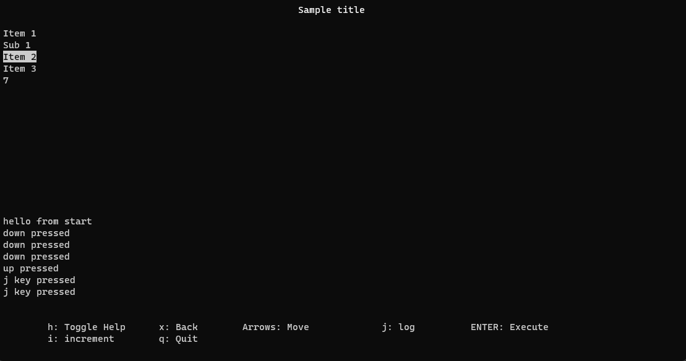

# Console UI
Simple C++ console UI.


#### Components
ConsoleUI has the following components that can be injected and retrieved after:
-A visual container holding the title, the menu, the log and the helper
-An event handler that handles key presses

## Usage
Creating a menu can be done either explicit or using the provided builder.
```cpp
MenuBuilder builder;
auto menu = builder.addItem("Item1")
                    .addItem("Item2")
                    .addSubmenu("Sub1").addItem("Item3")
                                       .addItem("Item4")
                    .endSubmenu()
                    .addItem("Item5")
                    .endSubmenu()
            .build();

auto menu = createMenu();
menu->createItem("Item 1");
menu->createItem("Item 2");
auto sub1 = menu->createSubmenu("Sub 1");
sub1->createItem("Item3");
sub1->createItem("Item4");
menu->createItem("Item5");
```
The visual container can be created by providing each component or using a default configuration.
The helper component already has the basic menu movement operations included.
```cpp
//default container with title, menu, empty log and empty helper
auto container = createSimpleContainer("Simple title", std::move(menu));

auto title = createTitle("Sample title");
auto log = createLog();
auto helper = createHelper();
helper->addHelper("i", "log i press");

auto container = createContainer(
    std::move(title),
    std::move(menu),
    std::move(log),
    std::move(helper)
);
```
The event handler already has events for basic menu movement.
```cpp
	ConsoleUI ui;
	
	auto eventListener = createEventListener();
	eventListener->registerKeyPressEventHandler('i', [&ui]() {ui.log("i key pressed"); });

	ui.setContainer(std::move(container));
	ui.setEventListener(std::move(eventListener));
	
	ui.start();
```
A more detailed example in *example/main.cpp*.